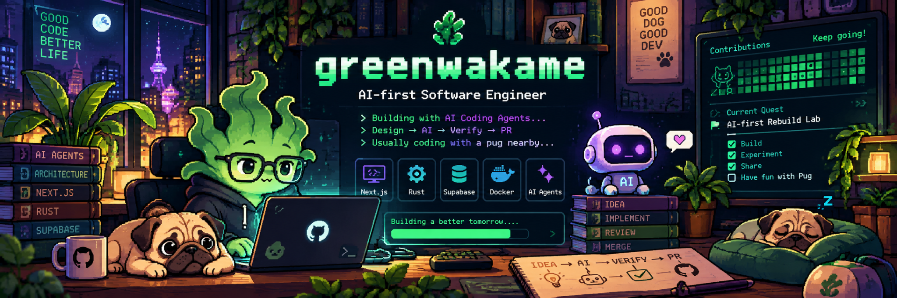
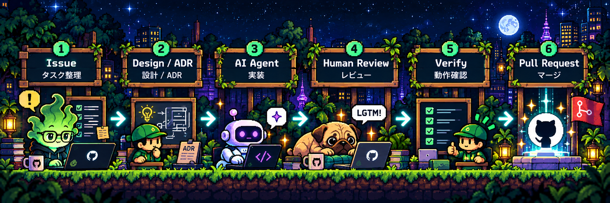
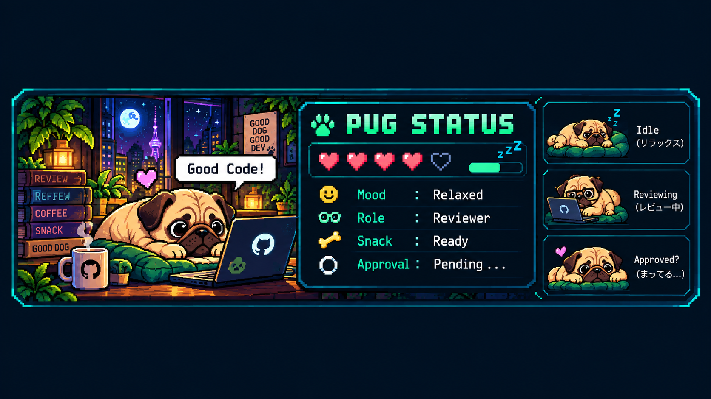
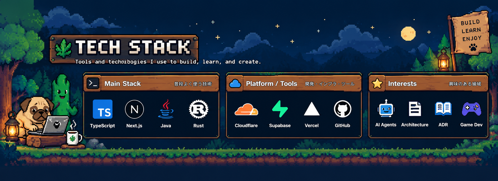

  

  

  
  
  

---

## 🐾 About Me

Hi, I'm **greenwakame**.

I enjoy building software with an **AI-first development style**:
AI agents help implement, while humans stay responsible for design, review, and verification.

**Explore / 成果物を見る:** [Showcase・作品一覧](https://greenwakame.github.io/greenwakame/) · [HyperFrames Lab・映像と制作記録](https://greenwakame.github.io/hyperframes-lab/) · [20秒のプロフィール映像](https://greenwakame.github.io/hyperframes-lab/cases/greenwakame-profile-pv/#film-heading)

- 🤖 AI coding agents
- 🏗 Software architecture
- 📝 ADR-driven development
- 🔍 Human-in-the-loop verification
- ⚡ Full-stack development
- 🐶 Pugs

---

## 🎮 Current Quest

### 🚀 [AI-first Rebuild Lab](https://github.com/greenwakame/ai-first-rebuild-lab)

Rebuilding a business system from scratch while experimenting with a practical
**AI-agent + human verification** development workflow.

  
  
  
  
  

**Project:** https://greenwakame.github.io/ai-first-rebuild-lab/

---

## 🤖 How I Build

  

> AI can write the code. Humans still own the decisions.

---

## 🐶 Pug Status

  

  <i>Build. Experiment. Review. Merge. Then give the pug a treat.</i>

---

## 🧰 Tech Stack

  

---

## 📊 Player Stats

  
  

  

---

## 📈 Activity

  Contribution activity — pug approved 🐶

## 🐍 Contribution Snake

  <picture>
    <source
      media="(prefers-color-scheme: dark)"
      srcset="https://raw.githubusercontent.com/greenwakame/greenwakame/gh-pages/github-contribution-grid-snake-dark.svg"
    />
    <source
      media="(prefers-color-scheme: light)"
      srcset="https://raw.githubusercontent.com/greenwakame/greenwakame/gh-pages/github-contribution-grid-snake.svg"
    />
    
  </picture>

---

  🌿 greenwakame · 🤖 AI agents · 🐶 pug approved

